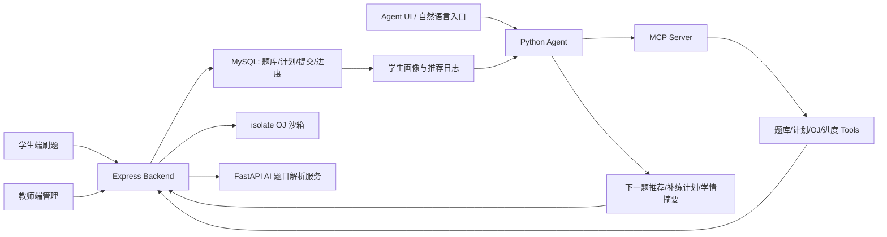

# Agent 驱动刷题系统包装方案

## 1. 简历项目定位

项目名称建议：

**GESP Agent 智能刷题与成长计划系统**

一句话描述：

基于 Vue 3、Node.js、MySQL、Redis、OJ 沙箱判题和 MCP Agent 工具链，将原有 GESP 成长计划平台升级为面向学生训练闭环的智能刷题系统，支持学习计划编排、题目推荐、代码判题、进度追踪、错题复练和教师侧学情分析。

更工程化的描述：

在原有“学习计划 + 客观题 + OJ 判题 + 学生进度”能力之上，引入 Agent 调度层，把题库查询、计划任务、提交记录、判题结果、学生进度等能力封装为可调用工具，由 Agent 根据学生历史表现自动生成下一阶段刷题路径，并为教师提供自然语言管理和学情诊断入口。

## 2. 当前项目可支撑的基础能力

已有业务基础：

- **学习计划管理**：支持计划、任务、客观题、OJ 编程题绑定，学生加入计划后可按任务推进。
- **在线判题能力**：基于 isolate 沙箱执行 OJ 代码，记录提交状态、判题结果、测试点通过数、耗时和练习时长。
- **进度闭环**：维护 `user_task_progress`、`user_exam_progress`、`user_oj_progress`、`user_plan_progress`，支持计划、任务、学生维度的完成情况查询。
- **教师管理视图**：已有教师侧计划分配、学生进度、提交记录、计划完成情况等页面。
- **AI 题目处理**：已有 Python FastAPI AI 服务，可从 PDF 提取题目并生成解析。
- **Agent 子系统雏形**：已有 `agent/` 模块，采用本地 Python Agent + 云端 MCP Server + 后端 API 工具封装的架构，已包含题目、OJ、学习计划等 MCP tools。

因此这个项目不是从零写“AI 概念”，而是已有完整刷题平台，再把 Agent 放到决策和自动化层。

## 3. 目标系统形态

系统可以包装成三个角色的闭环：

### 学生侧

- 查看今日待完成任务。
- 进行客观题练习和 OJ 编程题提交。
- 根据 AC、WA、TLE、未提交、练习耗时等行为获得下一题推荐。
- 错题和薄弱知识点自动进入复练队列。
- 查看成长计划进度、连续训练情况、薄弱模块和阶段目标。

### 教师侧

- 用自然语言创建或调整成长计划，例如“给 GESP 二级学生安排 7 天循环、每天 3 道选择题 + 1 道编程题”。
- 查看班级完成率、卡点题目、低通过率知识点、长期未提交学生。
- 让 Agent 自动生成补练任务、提醒名单、个性化复习建议。
- 对题目增删改、批量分配、推送提醒等高风险操作走审批或确认机制。

### Agent 侧

- 读取学生画像、计划任务、题目难度、提交记录和进度数据。
- 调用题库查询、学习计划、OJ 判题、进度查询等 MCP tools。
- 生成“下一步训练计划”，并将推荐结果落库。
- 定时扫描学习进度，发现落后、连续错误、长时间未提交等状态。
- 产出教师可读的学情摘要和学生可执行的刷题清单。

## 4. 后续可完成的核心模块

### 4.1 学生刷题画像

新增或扩展学生画像数据：

- 等级目标：GESP 1-8 级。
- 知识点掌握度：按知识点统计正确率、AC 率、平均耗时、最近错误。
- 题型表现：客观题、代码题、模拟考试分开统计。
- 训练状态：连续训练天数、逾期任务数、最近一次提交时间。
- 风险标签：长期未提交、低正确率、反复 WA、做题过快但正确率低。

可落地表：

- `student_practice_profile`
- `student_knowledge_mastery`
- `agent_recommendation_logs`
- `agent_training_sessions`

### 4.2 Agent 推荐引擎

第一版不用复杂模型，先做规则 + LLM 解释：

- 最近错题优先复练。
- 当前计划未完成任务优先。
- 同级别低通过率知识点补题。
- 已连续 AC 的知识点提高难度。
- 连续 WA 的题目给提示、解析或降阶题。
- 到期前自动压缩任务量并保留核心题。

推荐输入：

- 学生当前计划。
- 已完成任务、未完成任务。
- OJ 提交 verdict、通过测试点、耗时。
- 客观题错题和知识点。
- 题目难度、等级、知识点标签。

推荐输出：

```json
{
  "student_id": 1001,
  "goal": "GESP 二级循环与数组专项补强",
  "tasks": [
    {
      "type": "oj",
      "problem_id": 88,
      "reason": "最近两次数组题未通过，推荐同知识点低一档难度题"
    },
    {
      "type": "objective",
      "exam_id": 12,
      "reason": "补齐循环边界条件错题"
    }
  ]
}
```

### 4.3 自适应成长计划

把现在的固定计划升级成动态计划：

- 教师创建一个目标，例如“30 天通过 GESP 三级”。
- Agent 根据学生初始水平生成任务序列。
- 每次提交后刷新计划状态。
- 计划可自动插入补练任务、跳过已掌握题、调整难度。
- 教师仍保留最终确认权，避免 Agent 自动修改正式教学安排造成失控。

### 4.4 刷题过程 Agent

学生刷题时 Agent 不直接给答案，而是分层提示：

1. 第一次错误：提示输入输出边界。
2. 第二次错误：提示可能的数据结构或循环条件。
3. 多次错误：给最小反例或伪代码方向。
4. AC 后：总结本题考点，推荐下一题。

这比“AI 直接讲题”更适合写在简历里，因为它体现了产品约束和教育场景设计。

### 4.5 教师学情 Agent

教师可用自然语言问：

- “哪些学生这周没有完成二级计划？”
- “找出连续 3 次 OJ 未通过的学生。”
- “给每个学生生成一份下周补练计划。”
- “这套计划里哪几道题通过率最低？”

Agent 调用 MCP tools：

- `list_students`
- `list_learning_plans`
- `get_student_progress`
- `list_questions`
- `verify_oj_code`
- 后续新增 `get_student_practice_profile`、`create_adaptive_plan`、`recommend_next_tasks`

## 5. 推荐架构



## 6. MVP 实现路线

### 第一阶段：可演示闭环

目标：能让简历项目变成真实可展示功能。

- 新增 `recommend_next_tasks` 后端接口。
- 基于当前计划、未完成任务、OJ 提交结果返回 3-5 个推荐题。
- 在学生计划页增加“智能推荐下一步”区域。
- 在教师学生进度面板增加“Agent 学情摘要”按钮。

验收标准：

- 学生提交 OJ 后，推荐列表会变化。
- 未完成任务、错题、连续 WA 会影响推荐原因。
- 教师能看到每个学生的推荐依据，而不是只看到题目列表。

### 第二阶段：Agent 工具化

目标：让推荐能力接入现有 `agent/` 模块。

- 新增 MCP tool：`recommend_next_tasks`。
- 新增 MCP tool：`get_student_practice_profile`。
- 新增 MCP tool：`create_remedial_plan`。
- Agent 可以通过自然语言触发推荐和补练计划创建。

验收标准：

- 教师输入自然语言，Agent 能查询学生进度并生成计划建议。
- 高风险写操作需要确认或审批。

### 第三阶段：个性化训练系统

目标：形成完整刷题系统。

- 引入知识点掌握度模型。
- 建立错题复练队列。
- 支持每日训练任务自动生成。
- 支持班级学情日报、周报。
- 支持 Agent 定时扫描并提醒教师。

验收标准：

- 每个学生有独立推荐路径。
- 推荐理由可解释。
- 教师能看到班级维度薄弱点和个体补练建议。

## 7. 简历写法

### 简历标题

**GESP Agent 智能刷题与成长计划系统**

### 简历项目描述

基于 Vue 3 + TypeScript、Node.js/Express、MySQL、Redis、isolate OJ 沙箱和 Python Agent/MCP 架构，开发面向 GESP 编程等级认证的智能刷题平台。系统将学习计划、题库、在线判题、学生进度和 Agent 工具调用整合为训练闭环，支持教师创建成长计划、学生在线刷题、提交自动判题、进度追踪、错题复练和个性化推荐。

### 简历要点版本 A：偏后端/全栈

- 设计并实现 GESP 成长计划刷题平台，支持客观题练习、OJ 编程题提交、isolate 沙箱判题、任务进度统计和教师端学情管理。
- 基于 MySQL 建模学习计划、任务、题目、提交记录和用户进度，打通 `learning_plans`、`learning_tasks`、`oj_submissions`、`user_oj_progress` 等核心数据链路。
- 封装题库查询、学习计划、OJ 验证、学生进度等能力为 MCP tools，为后续 Agent 自动推荐、自然语言管理和补练计划生成提供工具层。
- 规划并落地 Agent 驱动刷题闭环：根据学生提交结果、正确率、耗时、未完成任务和知识点薄弱项，动态推荐下一步练习内容并生成可解释推荐原因。

### 简历要点版本 B：偏 AI Agent

- 构建教育场景 Agent 架构，将传统刷题平台升级为可调用工具、可读进度、可执行计划的智能训练系统。
- 设计 Agent 推荐流程：读取学生计划和提交记录，调用题库/进度/OJ tools，生成个性化刷题清单、错题复练任务和教师侧学情摘要。
- 采用 MCP Server 解耦 Agent 与业务后端，将题目管理、学习计划、OJ 判题和学生查询封装为安全可控的工具调用，并对敏感操作保留审批机制。
- 结合 OJ 判题结果和学习计划进度构建学生画像，支持连续错误检测、薄弱知识点识别、任务逾期提醒和补练计划生成。

### 简历要点版本 C：保守真实版

如果当前还没有完整实现推荐闭环，可以这样写，避免过度包装：

- 开发 GESP 编程训练平台，已实现学习计划管理、客观题练习、OJ 判题、学生进度追踪和教师端管理能力。
- 设计 Agent 驱动刷题系统方案，将现有题库、学习计划、判题结果和学生进度封装为 MCP tools，为个性化推荐、错题复练和自然语言教学管理提供扩展基础。
- 已完成 Agent 子系统雏形，包括题目、OJ、学习计划等工具封装，后续可基于学生提交记录和知识点掌握度实现自适应训练路径。

## 8. 面试讲法

可以按这个逻辑讲：

1. 原系统是一个 GESP 练习平台，已经有题库、OJ、学习计划和进度。
2. 痛点是计划是静态的，教师要手动判断学生下一步做什么。
3. 我把系统升级方向定义成 Agent 驱动刷题系统。
4. Agent 不直接替代业务系统，而是调用后端封装出的工具。
5. 推荐逻辑先用规则保证稳定，再用 LLM 生成解释和教学建议。
6. 判题、提交、进度这些确定性结果仍由后端和数据库负责，Agent 只做编排、诊断和推荐。
7. 这样既能控制风险，也能让 AI 真正嵌入教学流程。

一句话总结：

我做的不是单纯接一个聊天机器人，而是把刷题平台里的题库、计划、判题和学情数据抽象成 Agent 可调用工具，让 Agent 能基于真实学习行为生成下一步训练任务，形成“做题 -> 判题 -> 画像更新 -> 推荐 -> 补练”的闭环。

## 9. 不建议这样写

避免写：

- “使用大模型自动教学生刷题。”
- “实现全自动 AI 教师。”
- “基于 AI 自动生成所有学习计划。”
- “大模型智能判题。”

这些表述太虚，且容易被追问到无法证明。

更建议写：

- “Agent 调用业务 tools 编排刷题流程。”
- “基于判题结果和进度数据进行可解释推荐。”
- “把学习计划从静态任务升级为动态训练闭环。”
- “高风险操作保留审批，保证教育管理场景的可控性。”
